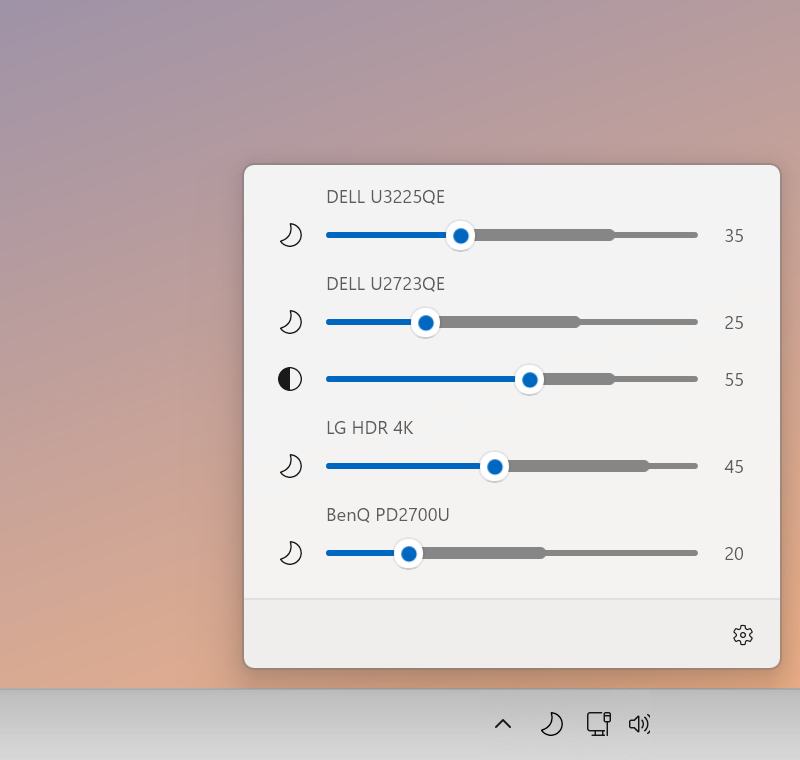
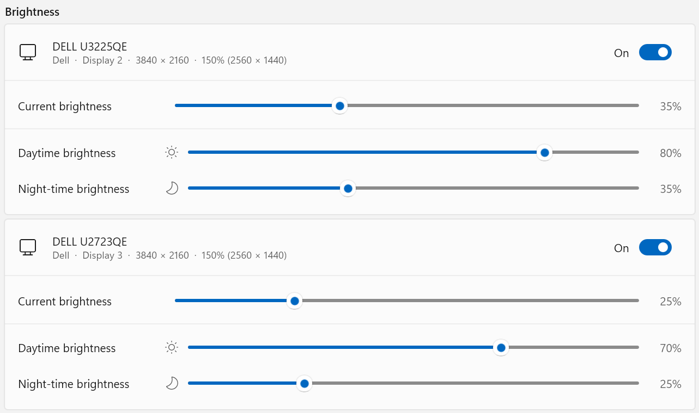

<div align="center">


# Astro Dimmer

**Your screens, in step with the sun.**

Astro Dimmer dims your monitors at sunset and brightens them again at sunrise, automatically, every day.

[](https://github.com/thenail/astrodimmer/releases/latest)
[](https://github.com/thenail/astrodimmer/releases)
[](https://thenail.github.io/astrodimmer/)
[](https://github.com/thenail/astrodimmer/search?l=c%2B%2B)
[](LICENSE)

[**Download for Windows**](https://github.com/thenail/astrodimmer/releases/latest) · [Website](https://thenail.github.io/astrodimmer/) · [Questions](https://thenail.github.io/astrodimmer/#faq)



</div>

## What it does

- **Follows the sun.** Put a pin on the map and Astro Dimmer works out sunrise and sunset for every day of the year, wherever you are.
- **One slider per monitor.** Click the icon on the taskbar for a panel that looks like part of Windows.
- **A level for each screen.** Set a daytime and a night-time level per monitor. Contrast can follow the schedule too.
- **Your timing.** Shift the change earlier or later by up to three hours, and fade gently instead of switching at once.
- **Steps aside when you want it to.** Drag a slider yourself and that screen is left alone until the next sunrise or sunset.
- **Quiet and private.** It lives on the taskbar, starts with Windows and needs no account. Your location stays on your computer.
- **19 languages**, following your Windows language.

<p align="center">
  
</p>

## Install

Download the installer from the [latest release](https://github.com/thenail/astrodimmer/releases/latest):

| Your PC | File |
| --- | --- |
| Most PCs (Intel and AMD) | `AstroDimmer-setup-<version>.exe` |
| ARM-based PCs (e.g. Snapdragon) | `AstroDimmer-setup-ARM64-<version>.exe` |

It installs for your user account, with no administrator password needed. Windows 11, and Windows 10 from version 1809 (October 2018 Update) onwards.

## Will it work with my monitor?

Astro Dimmer talks to external monitors over **DDC/CI**, the standard most monitors from recent years support. If a monitor doesn't appear, look for a DDC/CI setting in the monitor's own on-screen menu and switch it on. The built-in screen of a laptop isn't supported.

## Building from source

Needs Visual Studio 2026 with the *Desktop development with C++* workload and the *Windows App SDK C++* component.

```powershell
.\build.ps1                               # Debug x64, runs the tests
.\build.ps1 -Configuration Release -Platform ARM64
.\build.ps1 -Installer                    # Release build plus the setup exe
```

The app is C++/WinRT on WinUI 3. `src/AstroDimmer.Core` holds the platform-independent parts (solar times, scheduling, settings), covered by `tests/AstroDimmer.Tests`.

Handy switches when working on the UI: `--show` opens the panel at startup, `--pin` keeps it open, `--settings` opens Settings, `--theme=dark|light`, `--lang=de`, and `--simulate-displays=3` adds extra monitors to the UI.

## Privacy

Astro Dimmer does not collect any data. It has no account, no analytics and no tracking, and it never sends anything to its developer. Your location and settings are stored only on your computer.

This program will not transfer any information to other networked systems unless specifically requested by the user or the person installing or operating it. To find where you are, it asks Windows location services for your approximate position: when you press *Auto position detection*, and once when Settings first opens with no location saved. Only if you pressed the button and Windows can't say does it ask the online service [ipapi.co](https://ipapi.co/privacy/) to estimate your location from your internet address.

## Code signing policy

Free code signing provided by [SignPath.io](https://signpath.io), certificate by [SignPath Foundation](https://signpath.org).

Releases are built from this repository by GitHub Actions and signed only after a maintainer has approved them.

- Committers and reviewers: [Kristian Nagel](https://github.com/thenail)
- Approvers: [Kristian Nagel](https://github.com/thenail)

## License

[MIT](LICENSE)
